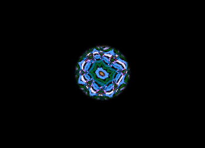
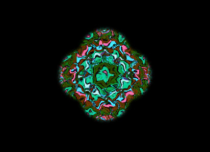

# React, CSS Animation Challenge

## Overview

This repository showcases an innovative animation built entirely with **React and pure CSS**. The animation challenge demonstrates advanced React techniques and CSS animations to create visually appealing and dynamic effects. Designed for both educational purposes and to impress, this project highlights the potential of combining React's reactivity with the power of CSS animations to create interactive web elements that can enhance any web application.

## The challenge

This challenge has been an incredibly rewarding experience and a true testament to the power of perseverance and creativity. Taking on this challenge allowed me to push the boundaries of what I thought was possible using only React for state management and pure CSS for styling. I am genuinely pleased with the outcome; achieving such dynamic and visually appealing animation under these constraints has been immensely satisfying.

One of the **most challenging** aspects of this project was undoubtedly the use of **polygons**. The complexity of understanding their construction from scratch and then implementing them correctly was a significant hurdle. I was forced to dive deep into the mathematics and logic behind them, which, although challenging, turned out to be incredibly enriching. This learning process not only enabled me to achieve the desired effects in the animation but also broadened my understanding and appreciation for design and programming.


This project was more than just a technical exercise; it was a **creative adventure that challenged me to explore new frontiers in development and animation design**. The satisfaction of overcoming these challenges and seeing the project come to life has been immensely rewarding.

The development of this project was an intriguing journey that took me approximately **10 hours of dedicated work**. This time was filled with intensive research, exploring various shapes, filters, and methods, and searching for the correct SVGs that perfectly aligned with the vision I had in mind. The process was both challenging and enriching, as each step along the way offered new lessons and opportunities to refine my skills.

<div align="center">
    
    
</div>

## Functioning

- **State Variables and Hooks**: 
  - The component initializes several state variables to manage the sizes, positions, and animations of circles and polygons. 
  - The `useEffect` hook triggers the animation sequences upon component mount.

- **Animating Circles**: 
  - The animation begins with the manipulation of circles. This is achieved through a series of promises that sequentially adjust the circles' sizes and positions to create movement. 
  - The circles expand, move to the sides, top, and bottom, and then reset, creating a dynamic, flowing effect. These animations are looped indefinitely.

- **Animating Polygons**: 
  - Alongside the circle animations, polygon animations are controlled by adjusting their scale and rotation. 
  - Initially, the polygon is scaled up and rotated, and then it's reset to its original state. 
  - This scaling and rotation create a visually appealing effect that complements the circle animations.

- **SVG Elements**: 
  - The animation utilizes SVG for rendering circles and polygons. 
  - Various SVG elements (`<circle>`, `<rect>`, `<mask>`, `<filter>`, and `<pattern>`) are used to define shapes, apply image patterns, and create effects like glow and deformation.

- **CSS Animations and Transitions**: 
  - CSS transitions are applied to the circles and polygons to smooth the animations. 
  - Additionally, keyframe animations change the hue of the image patterns, adding a dynamic color effect.

- **Image Patterns**: 
  - The component uses SVG patterns to fill shapes with images. 
  - These patterns are animated to rotate their hue, creating a lively, changing background for the shapes. 
  - The deformation filter applied to the patterns adds a unique, distorted look to the images.

- **Filters for Visual Effects**: 
  - SVG filters like `feGaussianBlur` and `feDisplacementMap` are used to create glow effects around the circles and a distorted, dynamic appearance for the image patterns. 
  - These filters enhance the visual complexity and attractiveness of the animation.

- **Responsive and Interactive Animation**: 
  - The animation is designed to be both visually captivating and interactive. 
  - Through its continuous loop and the dynamic, responsive changes in size, position, and color, it creates a mesmerizing visual experience.

- **Infinite Loop and Recursion**: 
  - The animation sequences are designed to run indefinitely through recursive function calls. 
  - This ensures the animation continues to loop, maintaining the viewer's engagement.

## Getting Started

### Installation

```
git clone https://github.com/marcosgperez/animation.git
cd animation
```

### Install dependencies

```
npm install
```

### Start the development server

```
npm run start
```

The application should now be running on http://localhost:3000. Open it in your browser to view the animation!
